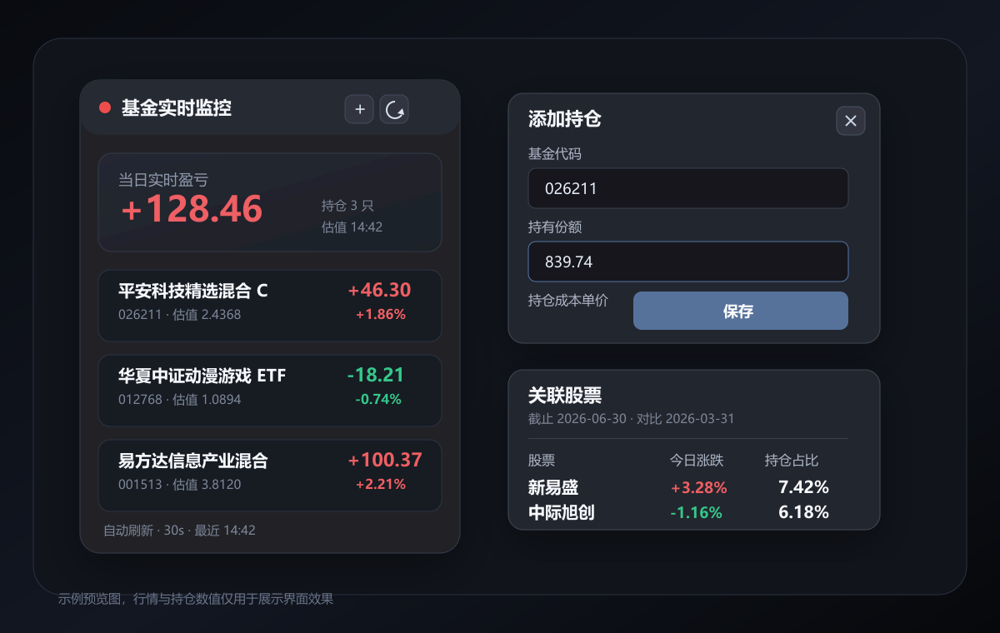

# Fund Desktop Monitor

一个深色科技风的 Windows 桌面基金实时盈亏监控小程序。双击 exe 启动后，它会在本地保存你的持仓信息，并每 30 秒刷新基金盘中估值、当日实时盈亏和关联股票信息。

[下载 Windows 安装版](https://github.com/Cola-Awei/Fund-Desktop-Monitor/releases/latest/download/Fund-Desktop-Monitor-Setup-0.1.0.exe)
· [查看 Releases](https://github.com/Cola-Awei/Fund-Desktop-Monitor/releases)



> 截图中的基金、金额和股票数据仅用于展示界面效果，不代表真实持仓或投资建议。

## 适合谁

Fund Desktop Monitor 适合想把基金盈亏放在桌面角落里快速查看的人。它不是完整交易软件，也不会替代基金平台的正式收益数据；它更像一个轻量桌面看板，用来在盘中快速观察基金估值变化。

## 核心功能

- 双击 exe 启动，无需手动打开开发服务
- 深色无边框小窗口，支持拖动、缩放和最小化
- 右上角添加基金持仓，输入基金代码、持有份额、持仓成本单价
- 每 30 秒自动刷新基金实时估值
- 顶部展示当日实时盈亏汇总
- 红涨绿跌，符合 A 股常见配色习惯
- 点击单个基金查看关联股票明细
- 股票详情包含股票名称、代码、今日涨跌、持仓占比、较上期占比
- 本地持久化持仓数据，不上传到服务器

## 下载安装

1. 打开 [Releases](https://github.com/Cola-Awei/Fund-Desktop-Monitor/releases)。
2. 下载 `Fund-Desktop-Monitor-Setup-0.1.0.exe`。
3. 双击安装程序完成安装。
4. 启动 Fund Desktop Monitor，在右上角点击添加按钮录入基金。

也可以直接下载最新安装包：

```text
https://github.com/Cola-Awei/Fund-Desktop-Monitor/releases/latest/download/Fund-Desktop-Monitor-Setup-0.1.0.exe
```

## 使用方式

添加持仓时只需要填写三项：

- 基金代码：例如 `026211`
- 持有份额：你当前持有的基金份额
- 持仓成本单价：你的平均持仓成本

程序会用实时估值和最新单位净值计算当日实时盈亏，并用你的成本单价展示持仓盈亏参考。点击基金卡片可以进入关联股票弹窗，查看该基金披露持仓股票的实时涨跌和持仓占比变化。

## 数据来源与计算口径

基金实时估值来自天天基金公开接口 `fundgz.1234567.com.cn`。程序主要使用：

- `gsz`：实时估值
- `dwjz`：最新单位净值
- `gszzl`：实时估值涨跌幅
- `gztime`：估值时间

当日实时盈亏计算方式：

```text
(实时估值 gsz - 最新单位净值 dwjz) * 持有份额
```

基金关联股票来自东方财富/天天基金基金档案接口，股票实时涨跌来自东方财富行情接口。“较上期占比”按当前报告期持仓占比减上一报告期持仓占比计算；上一期不存在该股票时显示“新增”。

> 盘中估值不是基金公司最终公布净值，仅用于实时参考。最终收益请以基金公司公布净值和交易平台数据为准。

## 本地数据

持仓数据只保存在本机 Electron 用户数据目录中，文件名为：

```text
holdings.json
```

Windows 上通常位于：

```text
%APPDATA%/fund-desktop-monitor/holdings.json
```

删除或清空该文件即可重置本地持仓。

## 开发运行

需要安装 Node.js 18 或更高版本。

```bash
npm install
npm run dev
```

常用命令：

```bash
# 运行测试
npm test

# 构建前端、主进程和 preload
npm run build

# 打包 Windows 目录版 exe
npm run package

# 打包 Windows 安装包
npm run package:installer
```

打包后的目录版 exe 位于：

```text
release/win-unpacked/Fund Desktop Monitor.exe
```

安装版 exe 位于：

```text
release/Fund Desktop Monitor Setup 0.1.0.exe
```

## 技术栈

- Electron
- React
- TypeScript
- Vite
- Vitest
- electron-builder

## 版本

当前公开版本：`v0.1.0`

Release 附件提供 Windows 安装版 exe。GitHub 页面中自动生成的 Source code zip/tar.gz 是源码包，不是桌面安装程序。

## 免责声明

本项目仅用于个人基金持仓监控和学习交流。所有行情、估值和持仓数据均来自公开网络接口，可能存在延迟、缺失或误差。本项目不提供投资建议，不保证数据准确性、完整性和实时性。任何投资决策请以基金公司、交易平台和官方公告为准，风险自担。
